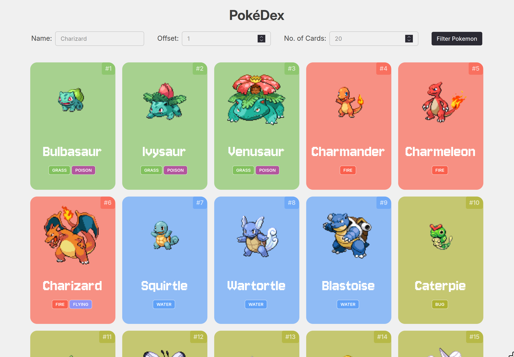

# [PokéDEX](https://pokedex-rho-rust-74.vercel.app/)

Link: https://pokedex-rho-rust-74.vercel.app/

A PokéDex where you can filter Pokémon by their name, parts of their name, or just show a bunch of pokemon based on the limits you set.

## Learnings:

1. Batching promises via Promise.all() to lower re-renders.
2. Searching without exact match
3. Playing Audio
4. CSS property (image-rendering)
5. Debouncing Input
6. Caching data

## To-do:

1. Dedicated page for each pokemon on clicking
2. Pagination
3. Infinite Scroll
4. 
